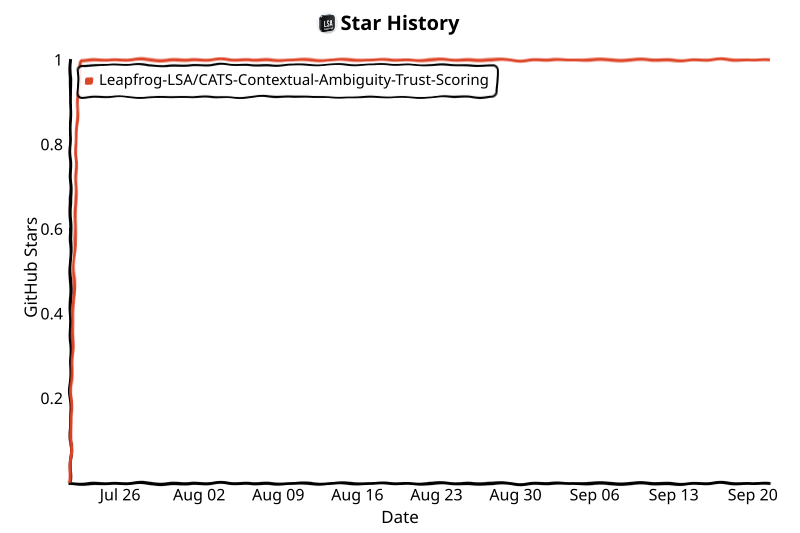

# CATS — Contextual Ambiguity & Trust Scoring

> **Trust intelligence for OSINT sources — not fact-checking, but source reliability over time.**

[](https://github.com/Leapfrog-LSA/CATS-Contextual-Ambiguity-Trust-Scoring/actions) [](https://codecov.io/gh/Leapfrog-LSA/CATS-Contextual-Ambiguity-Trust-Scoring) [](https://pypi.org/project/cats-scoring/) [](https://www.python.org/) [](LICENSE) [](docs/compliance.md) [](docs/compliance.md) [](https://github.com/Leapfrog-LSA/CATS-Contextual-Ambiguity-Trust-Scoring/stargazers)

***

## What CATS measures

CATS scores how *reliable a source's behaviour has been over time* — narrative consistency, sentiment volatility, publishing gaps, signs of algorithmic manipulation — not whether any single piece of content is true. It does not fact-check, does not label sources as "disinformation", and does not replace human judgement: every score is an ordinal ranking with a full explanation attached, meant to prioritise where a human looks closer.

## See it run

```
$ cats score ansa.it --source-type news
Source     https://ansa.it   (feed: https://ansa.it/rss.xml, 28 messages, 2026-09-15 → 2026-09-16)
Score      71.37   band: medium_high
Driver     silence (share 35.0%)
Signals    coherence 50.0 · volatility 14.81 · silence 0.0 · gaming 40.82 · domain_provenance 0.0
Language   italian (1.0)      Evidence  28 ≥ 3 ✓
Note       Ordinal score, not a probability. Cross-validate key claims. See docs/architecture.md.
```

<!-- TODO [umano]: sostituire con assets/cli_demo.png o una GIF dell'esecuzione reale -->

## Try it in 30 seconds

```bash
pip install cats-scoring
cats score <url>                       # any source URL — feed autodiscovery included
```

Or as a library:

```python
from cats.lite import score_feed

result = score_feed("https://example-news-outlet.it", source_type="news")
print(result["trust_score"], result["band"])
print(result["explanation"]["primary_driver"])
```

Try it in the browser instead: [](https://colab.research.google.com/github/Leapfrog-LSA/CATS-Contextual-Ambiguity-Trust-Scoring/blob/main/examples/cats_lite_demo.ipynb)

## A real use case

An OSINT analyst vetting a list of public source URLs before citing them in a report runs `cats score <url>` on each one and reads the **explanation** — which signal drove the score, and why — rather than treating `trust_score` as a verdict. A `medium` or `low` band means "look closer, cross-validate", not "discard": CATS surfaces behavioural patterns (irregular cadence, narrative drift, a clone domain) for a human to weigh alongside the actual content. It never outputs a "disinformation" label.

***

## Signals

| Signal         | What it measures                            | Method                                                     |
| -------------- | -------------------------------------------- | ---------------------------------------------------------- |
| **Coherence**  | Entity/argument consistency across messages | spaCy NER + Jaccard (or optional Sentence-BERT) similarity |
| **Volatility** | Abrupt narrative tone changes               | TextBlob (or optional BERT) sentiment spike detection      |
| **Silence**    | Anomalous temporal gaps in publishing       | Gap analysis vs. source-type thresholds                    |
| **Gaming**     | Signs of algorithmic manipulation           | Repetition + TTR + burst + vocab diversity                 |

On top of the four behavioural signals, an asymmetric **domain-provenance penalty** lowers the score of impersonation/clone domains (rare/cheap TLDs, free-hosting subdomains, brand typo-squats) when a source URL is supplied. It only ever *lowers* a score, never rewards a clean domain — see [architecture](docs/architecture.md).

## Trust score bands

| Score  | Band          | Recommended action            |
| ------ | ------------- | ------------------------------ |
| 80–100 | `high`        | Usable for OSINT               |
| 60–79  | `medium_high` | Cross-validate key claims      |
| 40–59  | `medium`      | Human review recommended       |
| 20–39  | `low`         | Human review required          |
| 0–19   | `very_low`    | Do not use without validation  |

> ⚠️ Scores are **ordinal rankings** of source reliability, not absolute probabilities.

***

## Honest limits

* Default NLP accuracy is roughly 55–62% (spaCy NER + TextBlob); optional SBERT/BERT backends do better.
* Ranking still leans heavily on one signal (`silence`), with `coherence` as the main tie-breaker.
* The default stack is Italian-optimised — other languages are detected and flagged, not blocked, but accuracy degrades.
* Calibration is validated on a 56-source train / 53-source future-holdout split — informative, not large-scale.
* Scores are ordinal, not probabilities, and are not a substitute for human review.

Full detail, numbers and the validation history: [docs/architecture.md](docs/architecture.md) and the [calibration findings](docs/calibration_findings_2026-07-28.md).

***

## Full deployment

Beyond the zero-infrastructure library, CATS also ships a full multi-tenant FastAPI service — PostgreSQL-backed audit logging, Redis rate limiting, batch scoring, and a GDPR Art. 13–22 contest/appeal flow — behind the same four signals and the same guarantees. See [docs/api.md](docs/api.md) for the REST reference and [docs/architecture.md](docs/architecture.md) for the deployment topology and security design.

***

## Documentation

| Document                                     | Description                                       |
| --------------------------------------------- | --------------------------------------------------- |
| [docs/README.md](docs/README.md)             | Full documentation index, organised by topic       |
| [docs/architecture.md](docs/architecture.md) | Signal algorithms, weight matrix, security design  |
| [docs/api.md](docs/api.md)                   | Full REST API reference                            |
| [docs/calibration.md](docs/calibration.md)   | Empirical weight calibration (genetic search)      |
| [docs/compliance.md](docs/compliance.md)     | GDPR + EU AI Act compliance                        |

***

## Roadmap

CATS has shipped through v1.6 (calibrated weights, the domain-provenance penalty, and the language/evidence guardrails); active work is on adoption (CLI, MCP server, a public demo) before any further signal changes. Full plan: [docs/piano_sviluppo_roadmap_2026-07.md](docs/piano_sviluppo_roadmap_2026-07.md).

***

## Contributing

Issues and PRs are welcome — see [CONTRIBUTING.md](CONTRIBUTING.md) for the
dev setup, code standards, and the checklist for adding a new signal. Please
also read the [Code of Conduct](CODE_OF_CONDUCT.md).

If CATS is useful to you, **consider starring the repo ⭐** — it helps others
doing OSINT/disinformation work find it.

<!-- star-history:start -->
<picture>
  <source media="(prefers-color-scheme: dark)" srcset="assets/star-history/star-history-dark.svg">
  
</picture>
<!-- star-history:end -->

***

## License

[MIT](LICENSE) — technical@cats-system.org
