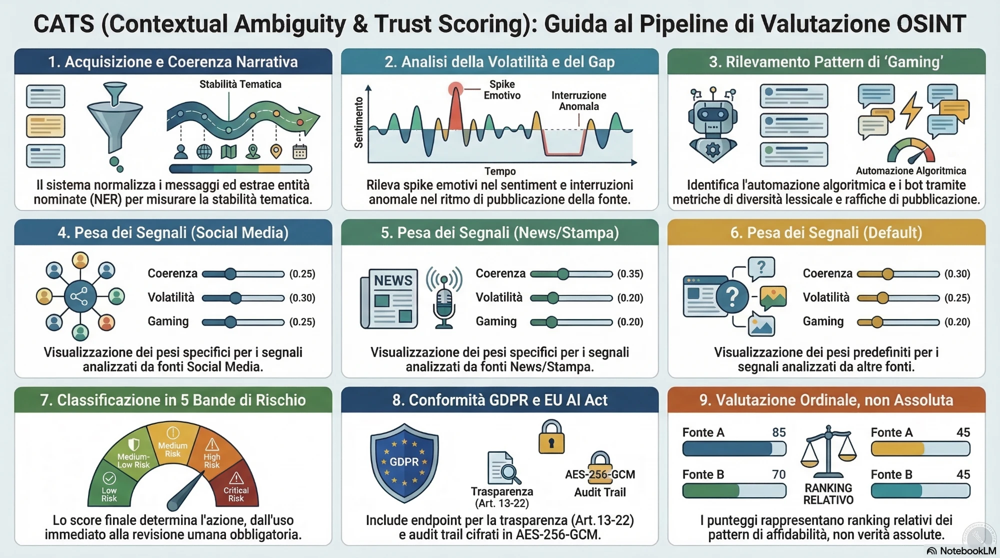

# CATS — Contextual Ambiguity & Trust Scoring

> **Trust intelligence for OSINT sources — not fact-checking, but source reliability over time.**

[](https://github.com/Leapfrog-LSA/CATS-Contextual-Ambiguity-Trust-Scoring/actions) [](https://codecov.io/gh/Leapfrog-LSA/CATS-Contextual-Ambiguity-Trust-Scoring) [](https://www.python.org/) [](LICENSE) [](docs/compliance.md) [](docs/compliance.md)

***

## What is CATS?

| ❌ Fact-checking             | ✅ CATS                                                         |
| --------------------------- | -------------------------------------------------------------- |
| "Is this information true?" | **"How reliable is this source, in this context, right now?"** |

CATS analyses the _behavioural patterns_ of a source over time — narrative consistency, sentiment volatility, temporal gaps, and signs of algorithmic manipulation — and returns a transparent, explainable trust score.

***

## Signals

| Signal         | What it measures                            | Method                                                     |
| -------------- | ------------------------------------------- | ---------------------------------------------------------- |
| **Coherence**  | Entity/argument consistency across messages | spaCy NER + Jaccard (or optional Sentence-BERT) similarity |
| **Volatility** | Abrupt narrative tone changes               | TextBlob (or optional BERT) sentiment spike detection      |
| **Silence**    | Anomalous temporal gaps in publishing       | Gap analysis vs. source-type thresholds                    |
| **Gaming**     | Signs of algorithmic manipulation           | Repetition + TTR + burst + vocab diversity                 |

***

## Try it in 5 lines (no infrastructure)

No database, no Redis, no API keys — the signal pipeline as a plain library call:

```python
from cats.lite import score

result = score([
    {"timestamp": "2026-01-01T08:00:00Z", "text": "Il governo annuncia un piano economico."},
    {"timestamp": "2026-01-01T12:00:00Z", "text": "I sindacati commentano il piano."},
    {"timestamp": "2026-01-02T09:00:00Z", "text": "Il parlamento discute la legge di bilancio."},
], source_type="news")

print(result["trust_score"], result["band"], result["explanation"]["primary_driver"])
```

Install from PyPI: `pip install cats-scoring` (add `cats-scoring[sbert]` for the multilingual coherence backend, and `python -m spacy download it_core_news_lg` for full-fidelity NER coherence — without it the signal degrades to a neutral value). The full API below adds persistence, auditing and GDPR endpoints.

Or try it in the browser: [](https://colab.research.google.com/github/Leapfrog-LSA/CATS-Contextual-Ambiguity-Trust-Scoring/blob/main/examples/cats_lite_demo.ipynb)

***

## Quick Start (full deployment)

```bash
# 1. Clone and configure
git clone https://github.com/Leapfrog-LSA/CATS-Contextual-Ambiguity-Trust-Scoring.git && cd CATS-Contextual-Ambiguity-Trust-Scoring
cp .env.example .env          # fill in secrets (see .env.example)

# 2. Install
make dev-install              # deps + pre-commit hooks
make nlp-download             # spaCy it_core_news_lg + TextBlob corpora

# 3. Start services and run
make docker-up                # PostgreSQL 16 + Redis 7
make db-migrate               # Alembic migrations
uvicorn cats.api.main:app --reload

# 4. Test
make test
```

> **Generate a secure AUDIT\_ENCRYPTION\_KEY**: `make generate-key`

***

## API Example

```bash
curl -s -X POST http://localhost:8000/v1/cats/evaluate \
  -H "Authorization: Bearer $CATS_API_KEY" \
  -H "Content-Type: application/json" \
  -d '{
    "source_id": "twitter:example_handle",
    "messages": [
      {"timestamp": "2026-01-01T08:00:00Z", "text": "Governo annuncia piano economico."},
      {"timestamp": "2026-01-01T09:00:00Z", "text": "Protesta dei lavoratori in piazza."},
      {"timestamp": "2026-01-01T10:00:00Z", "text": "Parlamento discute la legge di bilancio."}
    ],
    "context": {"source_type": "social"}
  }' | jq
```

```json
{
  "trace_id": "550e8400-e29b-41d4-a716-446655440000",
  "score": 68.4,
  "band": "medium_high",
  "requires_review": false,
  "signals": [
    {"name": "coherence",  "value": 71.2, "confidence": 0.3},
    {"name": "volatility", "value": 55.0, "confidence": 0.15},
    {"name": "silence",    "value": 0.0,  "confidence": 0.1},
    {"name": "gaming",     "value": 12.8, "confidence": 0.06}
  ],
  "language": {"detected": "italian", "confidence": 0.3, "marker_ratio": 0.24, "latin_script_ratio": 1.0},
  "evidence": {"messages": 3, "min_messages": 3, "sufficient": true, "mean_signal_confidence": 0.152}
}
```

***

## Trust Score Bands

| Score  | Band          | Recommended Action            |
| ------ | ------------- | ----------------------------- |
| 80–100 | `high`        | Usable for OSINT              |
| 60–79  | `medium_high` | Cross-validate key claims     |
| 40–59  | `medium`      | Human review recommended      |
| 20–39  | `low`         | Human review required         |
| 0–19   | `very_low`    | Do not use without validation |

> ⚠️ Scores are **ordinal rankings**, not absolute probabilities (WP 4.3).

***

## Architecture



```
Client (HTTPS + Bearer token)
        │
   nginx (rate 30 req/min · TLS 1.3 ready)
        │
   FastAPI — 9-phase pipeline
   ├─ POST /v1/cats/evaluate
   ├─ POST /v1/cats/batch                ← evaluate up to 50 sources at once
   ├─ GET  /v1/cats/explain/{trace_id}   ← GDPR Art.14/22
   ├─ POST /v1/cats/contest/{trace_id}   ← GDPR Art.22
   ├─ POST /v1/cats/contest/{id}/resolve ← GDPR Art.22 (human decision)
   ├─ POST /v1/cats/review/{trace_id}    ← flag for human review
   ├─ GET  /v1/cats/stats
   └─ GET  /health  /metrics
        │                │
     Redis 7          PostgreSQL 16
  (rate limiting)   (AES-256 audit log)
                    + APScheduler purge
```

The nginx reverse proxy (rate limiting, security headers) is configured in [`deploy/nginx.conf`](deploy/nginx.conf) and started by `make docker-up`. It listens on HTTP by default; a commented TLS 1.3 server block (with cert instructions) is provided in the same file — enable it before any non-local deployment.

See [docs/architecture.md](docs/architecture.md) for full signal and security details.

***

## Documentation

| Document                                     | Description                                         |
| -------------------------------------------- | --------------------------------------------------- |
| [docs/api.md](docs/api.md)                   | Full API reference                                  |
| [docs/architecture.md](docs/architecture.md) | Signal algorithms, weight matrix, security design   |
| [docs/compliance.md](docs/compliance.md)     | GDPR + EU AI Act compliance                         |
| [docs/eu\_ai\_act/](docs/eu_ai_act/)         | EU AI Act conformity scaffold (Annex IV, Art. 9/10) |
| [docs/calibration.md](docs/calibration.md)   | Empirical weight calibration (genetic search)       |
| [docs/calibration\_findings\_2026-07-28.md](docs/calibration_findings_2026-07-28.md) | Future-snapshot validation (concordance 0.755)      |
| [docs/signal\_research\_2026-07.md](docs/signal_research_2026-07.md) | Domain-provenance signal investigation (v2.0)       |
| [docs/signal\_diagnosis\_2026-07.md](docs/signal_diagnosis_2026-07.md) | Signal ablation/LOSO diagnosis: coherence is load-bearing (SBERT), volatility+gaming are dead weight |
| [docs/piano\_sviluppo\_roadmap\_2026-07.md](docs/piano_sviluppo_roadmap_2026-07.md) | Repo analysis, development plan & numbered roadmap (July 2026, in Italian) |
| [CHANGELOG.md](CHANGELOG.md)                 | Version history                                     |
| [CONTRIBUTING.md](CONTRIBUTING.md)           | Development guide                                   |
| [SECURITY.md](SECURITY.md)                   | Vulnerability reporting                             |

***

## Known Limitations (WP 4.1)

* **NLP accuracy \~55–62% (default)**: spaCy NER + TextBlob; optional BERT sentiment and Sentence-BERT coherence backends are available for higher accuracy (see `.env.example`)
* **Partially calibrated parameters**: signal weights are empirically calibrated with [`cats.calibration`](docs/calibration.md) and validated on a future snapshot (`data/calibrated_weights.json`), but band thresholds and silence thresholds remain unvalidated initial estimates
* **Small validation set (July 2026)**: calibration rests on 56 RSS-labelled sources, validation on a 53-source future snapshot; see the [6 Jul findings](docs/calibration_findings_2026-07-28.md) for the honest numbers (holdout concordance 0.755, Spearman +0.553) and their caveats
* **Single dominant signal**: discrimination currently rests almost entirely on `silence` (holdout ρ −0.43; coherence/volatility/gaming carry ~no rank information) — an adversary publishing on a regular cadence would collapse scores toward chance; see [signal research](docs/signal_research_2026-07.md) for the v2.0 hardening work
* **Italian-optimised**: using `it_core_news_lg`; other languages degrade accuracy — non-Italian input is detected and flagged in the response (`language.detected`), but scores are still computed with the Italian-tuned stack
* **Ordinal scoring only**: not suitable as sole basis for autonomous decisions

***

## Roadmap

### Done

| Version    | Status | Key features                                                                                                        |
| ---------- | ------ | ------------------------------------------------------------------------------------------------------------------- |
| **v1.0**   | ✅      | spaCy NER · 9-phase pipeline · GDPR API · Docker                                                                    |
| **v1.1**   | ✅      | BERT Italian sentiment · multi-tenant PostgreSQL · batch endpoint · Prometheus `/metrics` · nginx                   |
| **v1.2**   | ✅      | Sentence-BERT coherence · explainer attribution · weight calibration                                                |
| **v1.3**   | ✅      | Signal-polarity fix in aggregation · distant-supervision dataset (MBFC + disinfo networks) · snapshot accumulation · `cats.lite` + PyPI packaging |
| **v1.3.1** | ✅      | `CATS_WEIGHTS_FILE`/`CATS_API_KEYS` alias fix · contest-resolution endpoint (GDPR Art. 22) · per-key rate limiting  |

Already merged for the next release (unreleased): calibrated weights **validated on a future snapshot** (6 Jul 2026, holdout concordance 0.755 > 0.70 target) and shipped as the recommended production table in `data/calibrated_weights.json`; domain-provenance signal spike (`research/domain_provenance_spike.py`) showing +0.02 holdout concordance.

### Pending — v2.0 (2027)

1. **Signal hardening** — discriminative power currently rests on `silence` alone; the fifth **domain-provenance** signal is a v2.0 candidate pending calibration and re-validation (see `docs/signal_research_2026-07.md`).
2. **Content-credibility signal** — catch fake news published on ordinary domains, which domain structure alone cannot detect.
3. **AUC-ROC ≥ 0.78** on a larger validation set.
4. **Full EU AI Act technical documentation** (Annex IV/IX).

***

## License

[MIT](LICENSE) — technical@cats-system.org
